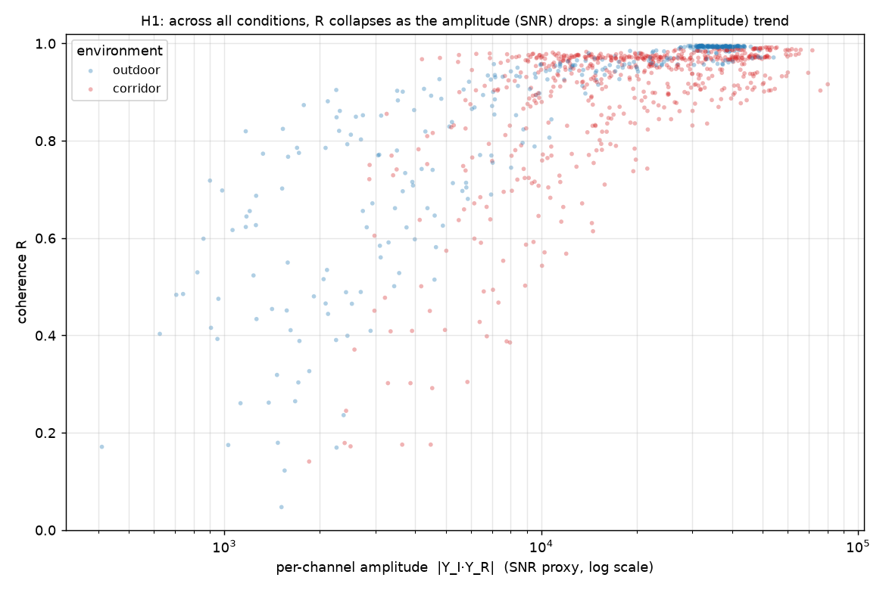
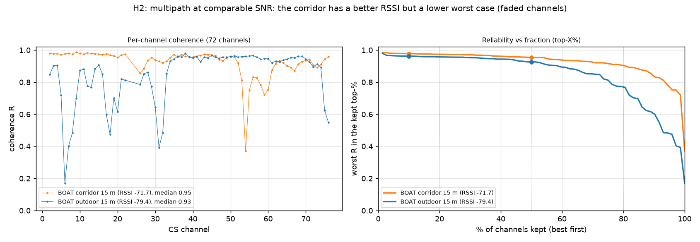
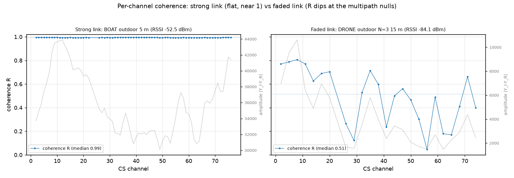
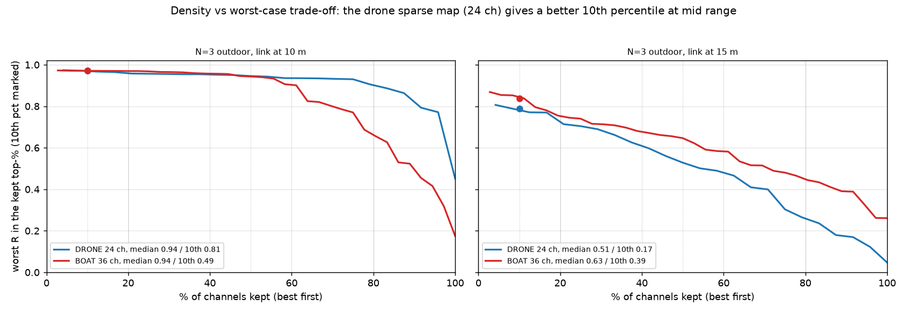

# Résultats de campagne — consistance des IQ (Channel Sounding)

Campagne du **2026-09-01**. Ce document rassemble les observations brutes et leur
interprétation. La métrique, le principe et la procédure sont décrits dans
[METHODE_ETUDE.md](METHODE_ETUDE.md) et [STUDY_PLAN.md](STUDY_PLAN.md).

Rappel de la métrique : `R_k` est la cohérence (longueur du vecteur résultant
moyen) de la phase du produit aller-retour `Y_I·Y_R` sur le canal *k*, sur une
capture statique. `R = 1` phase parfaitement stable, `R = 0` aléatoire. On
rapporte la **médiane** des `R_k` (score global) et le **10e percentile** (les
canaux les plus faibles). `R` est invariante à la distance absolue et au group
delay, donc aucune calibration n'est requise ; la distance n'intervient que comme
condition d'essai (elle fixe le bilan de liaison, donc le SNR).

---

## 1. Conditions du test

- **Cible** : nRF54L15DK, NCS v3.3.0.
- **Firmware** : commit `e7c8124` ; le profil et `CS_NUM_BEACONS` varient par test
  (le `config.txt` de chaque dossier de test archive la config exacte compilée).
- **Montage** : 1 initiateur (SNR 1057778811) + jusqu'à 3 réflecteurs fixes.
- **Distances** : mesurées au **télémètre laser** (métadonnée, pas de calibration).
- **Extérieur** : espace ouvert, LOS. **Intérieur** : couloir (guide d'onde,
  multitrajet dense).
- **Acquisition** : `uart_console.py --test`, port data VCOM 921600 bauds.
  30 s à N=1, 60 s à N=3 (couverture par canal partielle à N eleve).
- **Analyse** : `iq_consistency.py` (métrique `R` par canal et par beacon).

Deux mesures ont été **rejetées et refaites** car le canal n'était plus statique :
passage d'un camion (test extérieur 15 m) et un oiseau près d'un réflecteur
(avant le boat N=3 extérieur). Elles ne figurent pas dans les résultats.

---

## 2. Configurations testées

Deux des trois profils livrés, chacun à N=1 et N=3, en intérieur et/ou extérieur.

| Profil | Environnement | Carte de canaux | Particularité |
|---|---|---|---|
| `DRONE_FAST_OUTDOOR` | extérieur | thinning 3 → **24 canaux** | PBR + RTT, créneau court |
| `DRONE_INDOOR` | couloir | pleine → **72 canaux** | PBR pur, TX max |
| `BOAT_DOCKING` | couloir + extérieur | 72 (N=1) / thinning 2 → **36** (N=3) | PBR pur, **channel_map_repetition 2 à N≤2** |

À N=3, les 3 réflecteurs sont posés à 5 / 10 / 15 m simultanément : une seule
acquisition donne la cohérence par lien à trois bilans de liaison, plus l'effet
multi-beacon (ordonnancement inter-liens, couverture partielle par procédure).

---

## 3. Tableau récapitulatif (12 tests valides)

`R méd` / `R 10e` = médiane et 10e percentile de la cohérence sur les canaux.
Le RSSI est la condition de liaison. La distance par beacon (N=3) est reconstruite
par ordre de RSSI (l'index b0/b1/b2 dépend de l'ordre de connexion, pas de la
position).

### DRONE_FAST_OUTDOOR — extérieur, 24 canaux
| N | distance | RSSI (dBm) | R méd | R 10e | proc |
|---|---|---|---|---|---|
| 1 | 5 m | −63,9 | 0,985 | 0,981 | 499 |
| 1 | 15 m | −79,2 | 0,896 | 0,736 | 496 |
| 3 | 5 m | −52,4 | 0,993 | 0,992 | 304 |
| 3 | 10 m | −79,3 | 0,944 | 0,814 | 294 |
| 3 | 15 m | −84,1 | 0,515 | 0,172 | 306 |

### DRONE_INDOOR — couloir, 72 canaux
| N | distance | RSSI (dBm) | R méd | R 10e | proc |
|---|---|---|---|---|---|
| 1 | 5 m | −58,7 | 0,970 | 0,955 | 332 |
| 1 | 15 m | −75,7 | 0,807 | 0,468 | 267 |
| 3 | 5 m | −59,2 | 0,976 | 0,968 | 228 |
| 3 | 10 m | −64,1 | 0,976 | 0,878 | 234 |
| 3 | 15 m | −74,0 | 0,878 | 0,665 | 234 |

### BOAT_DOCKING — couloir (72 ch à N=1, 36 ch à N=3)
| N | distance | RSSI (dBm) | R méd | R 10e | proc |
|---|---|---|---|---|---|
| 1 | 5 m | −55,5 | 0,970 | 0,965 | 186 |
| 1 | 15 m | −71,7 | 0,954 | 0,834 | 184 |
| 3 | 5 m | −57,6 | 0,951 | 0,925 | 241 |
| 3 | 10 m | −66,7 | 0,876 | 0,376 | 242 |
| 3 | 15 m | −73,6 | 0,822 | 0,451 | 241 |

### BOAT_DOCKING — extérieur (72 ch à N=1, 36 ch à N=3)
| N | distance | RSSI (dBm) | R méd | R 10e | proc |
|---|---|---|---|---|---|
| 1 | 5 m (géom. B) | −52,5 | 0,994 | 0,993 | 185 |
| 1 | 15 m | −79,4 | 0,926 | 0,601 | 181 |
| 3 | 5 m | −52,5 | 0,994 | 0,992 | 226 |
| 3 | 10 m | −78,7 | 0,942 | 0,489 | 232 |
| 3 | 15 m | −83,5 | 0,634 | 0,390 | 228 |

---

## 4. Observations

### 4.1 La cohérence est d'abord pilotée par le SNR (H1)

Toutes conditions confondues, `R` suit le RSSI. À lien fort (5 m, RSSI de l'ordre
de −52 à −59 dBm), la cohérence **sature** au-dessus de 0,97 quel que soit le
profil et l'environnement (0,985 drone ext, 0,970 indoor, 0,970 boat couloir,
0,994 boat ext). À l'autre bout, le lien le plus faible de la campagne (drone N=3
à 15 m, −84,1 dBm) s'effondre à `R` médian 0,515 et 10e percentile 0,172.

La conséquence méthodologique est nette : **à 5 m on ne discrimine pas les
profils**, la cohérence est plafonnée par le SNR. Les différences de config
n'apparaissent qu'à distance, sur lien faible.

*Toutes les conditions (extérieur et couloir) tombent sur une même tendance :
`R` proche de 1 tant que l'amplitude par canal (proxy SNR) est haute, puis chute
quand elle baisse. La cohérence est bien gouvernée par le SNR par canal.*

### 4.2 Le multitrajet dégrade la cohérence à SNR égal (H2)

C'est l'observation la plus importante, obtenue en comparant le même profil
(DRONE, N=1, 15 m) entre extérieur et couloir :

| N=1, 15 m | canaux | RSSI | R méd | R 10e |
|---|---|---|---|---|
| extérieur | 24 | −79,2 | 0,896 | 0,736 |
| couloir | 72 | **−75,7** | 0,807 | **0,468** |

Le couloir a un **meilleur** bilan de liaison (effet guide d'onde, +3,5 dB) et
**pourtant** une cohérence plus basse, avec un 10e percentile qui s'effondre
(0,468 contre 0,736). Ce n'est donc pas le SNR qui dégrade `R` ici, mais le
**fading fréquentiel sélectif** : des canaux tombent dans les nulls du
multitrajet. La carte pleine 72 canaux les révèle ; la médiane reste correcte
mais la queue basse (les canaux fadés) trahit le multitrajet.

L'évolution 5 → 15 m est aussi bien plus brutale en intérieur : le 10e percentile
passe de 0,955 à 0,468 en couloir, contre 0,981 à 0,736 en extérieur.

*Même profil (boat, 72 canaux) à 15 m : le couloir (mieux servi en RSSI) a une
courbe top-X% qui plonge plus vite que l'extérieur, signe des canaux fadés.*

Le mécanisme se voit directement sur la cohérence par canal : sur un lien fort,
`R` reste plat près de 1 même quand l'amplitude varie ; sur un lien fade, `R`
plonge exactement aux creux d'amplitude (les nulls du multitrajet).

*À gauche, un lien fort (boat ext 5 m) : `R` plat à 0,99 alors que l'amplitude
(gris) varie fortement. À droite, un lien fade (drone ext N=3 15 m) : `R` suit
les creux d'amplitude et tombe jusqu'à ~0,05 dans les nulls.*

### 4.3 Le multi-beacon (N=3) ne dégrade pas la consistance par lien

À géométrie et distance fixées, la cohérence par lien à N=3 égale celle à N=1 :

| 5 m | N=1 | N=3 (lien à 5 m) |
|---|---|---|
| drone extérieur | 0,985 / 0,981 | 0,993 / 0,992 |
| indoor couloir | 0,970 / 0,955 | 0,976 / 0,968 |
| boat couloir | 0,970 / 0,965 | 0,951 / 0,925 |

Le pipeline N=3 tient (environ 230 à 300 procédures par beacon en 60 s, pas
d'effondrement de cadence anormal). Le passage à N=3 divise la cadence par
beacon par 3 (l'intervalle de connexion est multiplié par N), ce qui est le prix
attendu du round-robin, mais **pas** la qualité d'acquisition par lien. Le
multi-beacon est donc un facteur de cadence, pas de consistance.

### 4.4 Le vrai levier de config est la manière de ré-échantillonner chaque canal (H3)

Le résultat le plus riche vient de la comparaison boat vs drone/indoor, où deux
mécanismes opposés se révèlent.

**Le moyennage par répétition de carte (channel_map_repetition 2) monte la
médiane à faible N.** À N=1, le boat mesure chaque canal deux fois par round et
garde 72 canaux. À 15 m intérieur, cela le place très au-dessus de l'indoor :

| N=1, 15 m couloir | RSSI | R méd | R 10e |
|---|---|---|---|
| DRONE_INDOOR (rep 1) | −75,7 | 0,807 | 0,468 |
| BOAT (rep 2) | −71,7 | **0,954** | **0,834** |

Une partie de l'écart tient aux 4 dB de RSSI en faveur du boat, mais pas la
totalité : passer de 0,468 à 0,834 sur le 10e percentile est cohérent avec un
effet de moyennage qui lisse le bruit de phase, canal par canal.

**Le thinning arbitre le pire-cas.** À N=3, le boat perd ses deux atouts (la
répétition retombe à 1, le thinning réduit à 36 canaux) et l'indoor, qui garde
72 canaux, repasse devant. Comparé au drone extérieur à N=3, même environnement
et RSSI appariés :

| N=3, extérieur | canaux | 10 m (10e) | 15 m (10e) |
|---|---|---|---|
| DRONE (thinning 3) | 24 | **0,814** | 0,172 |
| BOAT (thinning 2) | 36 | 0,489 | **0,390** |

À mi-portée (10 m), la carte creuse du drone (24 canaux bien répartis) évite les
creux de fading et donne un bien meilleur 10e percentile. La carte plus dense
capte davantage de canaux, dont des fadés qui tirent le percentile vers le bas.
C'est le compromis **densité de canaux ↔ pire-cas** : plus de canaux veut dire
plus de diversité fréquentielle (utile pour la résolution et la période
d'ambiguïté), mais aussi plus de canaux morts qui plombent la queue basse.

*Courbes top-X% à N=3 extérieur. À 10 m, le drone (24 canaux) tient un meilleur
pire-cas (10e pct 0,81 contre 0,49). À 15 m, l'arbitrage s'inverse : la carte
plus dense du boat garde un peu plus de tenue (0,39 contre 0,17). Le compromis
n'est donc pas uniforme et dépend du bilan de liaison.*

### 4.5 Classement des profils

Le classement dépend de N et de l'environnement, il n'y a pas de vainqueur
unique :

- **À N=1**, en présence de multitrajet, le **boat** domine grâce à la répétition
  de carte (moyennage), surtout à distance.
- **À N=3**, le **drone** (thinning 3) offre le meilleur pire-cas à mi-portée, et
  l'**indoor** (72 canaux) la meilleure médiane en multitrajet dense.
- **À 5 m**, tous les profils sont équivalents (saturation par le SNR).

---

## 5. Limites et précautions

- **Mapping distance ↔ beacon (N=3)** : reconstruit par ordre de RSSI, pas par
  l'index de connexion. Fiable ici car les RSSI sont bien séparés, mais à noter.
- **Confond géométrie** : le boat extérieur à 5 m a été pris avec une géométrie
  différente (angle et position), d'où un RSSI de −52,5 dBm contre −63,9 pour le
  drone à 5 m, soit 11 dB d'écart à « même distance ». La comparaison directe
  boat/drone à 5 m extérieur n'est donc pas propre ; elle illustre surtout que la
  distance seule ne fixe pas le SNR (l'angle et l'environnement proche comptent).
- **L'estimateur de distance n'est pas fiable en multitrajet** et n'est pas une
  métrique de l'étude. Exemple marquant : un lien posé à 10 m (drone N=3) de
  bonne cohérence (`R` 0,944) est estimé à 21 m par l'estimateur. La consistance
  des tones, elle, reste bien définie. C'est la justification même du choix de
  cette métrique plutôt que la distance.
- **Canal statique requis** : deux mesures polluées (camion, oiseau) ont été
  rejetées et refaites. Toute mesure en présence d'un objet mobile est à écarter.

---

## 6. Implications

1. **Carte de canaux adaptative (H4)** : les résultats confirment que le sous-
   ensemble fiable dépend du profil et de l'environnement. Retirer les canaux
   fadés (creux du multitrajet, révélés par le 10e percentile bas) est plus
   efficace qu'une carte creuse fixe. Garder au moins une quinzaine de canaux
   pour préserver la diversité fréquentielle.
2. **À faible N, activer la répétition de carte** apporte un gain net de
   cohérence par le moyennage, à budget airtime supérieur.
3. **La discrimination des profils doit se faire à distance / lien faible**, pas
   à 5 m où tout sature.

---

## 7. Tests restants (perspectives)

- **Boat extérieur** dans son domaine natif (accostage courte portée, milieu
  ouvert peu réfléchissant) pour un verdict équitable sur le profil.
- **Drone en intérieur** (hors domaine) pour compléter la matrice profil ×
  environnement (robustesse croisée, Scénario 3).
- **Antenne** (hauteur, orientation) et **reproductibilité** (répétitions, run
  long) selon les Scénarios 6 et 7.
